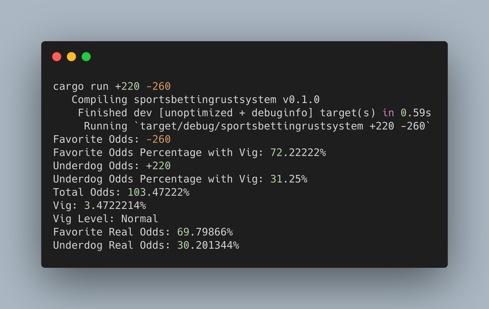

# sportsbettingrustsystem

Tool for betting the moneyline with American Odds
```
usage:
cargo run <underdog> <favorite> <bet>
```

A normal bettor betting $20
```
example:
cargo run +250 -260 20
```

Being cheap and betting a quarter
```
example:
cargo run +250 -260 .25
```

